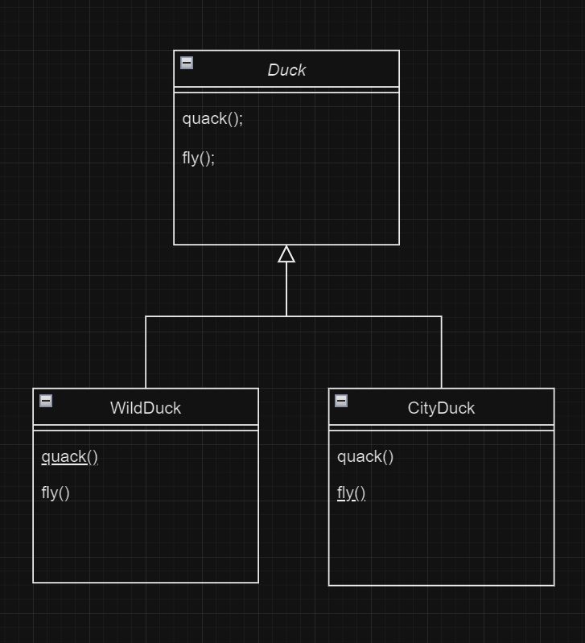
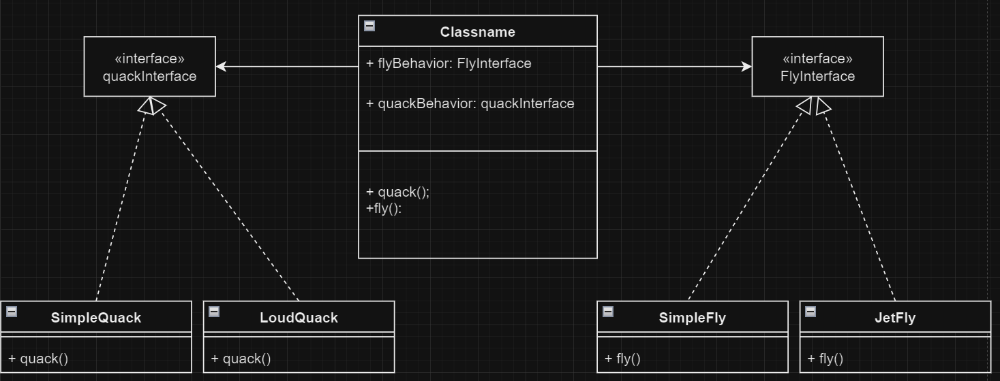

# Strategy Pattern

## Definition
The Strategy Pattern defines a family of **algorithms**, **encapsulates** each one and makes them **interchangeable** and thus makes the algorithm vary independently of the client that uses it. 
This is a behavioral design pattern that enables us to change the behavior of an object during runtime. this design pattern favours composition over inheritance. 

Imagine we have a Duck class which has two behaviors: 1-flying 2-quacking 
Now if you have different kinds of ducks the first thing that comes to your mind is to extend the Duck class and override its methods. Which would produce the below diagram: 
 
This is the standard solution which would cause a series of problems:
1. Imagine that we add another class that is a RubberDuck Class. As you know rubber ducks cannot fly, so this will cause RubberDuck to have method that it doesn't need which could complications down the line
2. If two of our child classes share the same behavior for example flying then we would have code duplication which is not good (imagine this happening across many many classes!!!)
3. if we want to change the behavior we would have to create a new class for each new behavior which would cause class explosion

the solution these problems is the strategy pattern. by using interfaces and dependency injection we can create this pattern shown as diagram below:
 
by having the behaviors added as a constructor parameter (or setter injection depending on your taste), we can change the behavior of Duck class at runtime and if a new behavior is added we can create an interface or a new implementation for it. 
this approach also enables us to use inheritance but only where it matters, for example if add a new method display() that displays the Duck in GUI, this method would be class specific, so we can extend Duck class and override
the display method while also injecting the former behaviors 